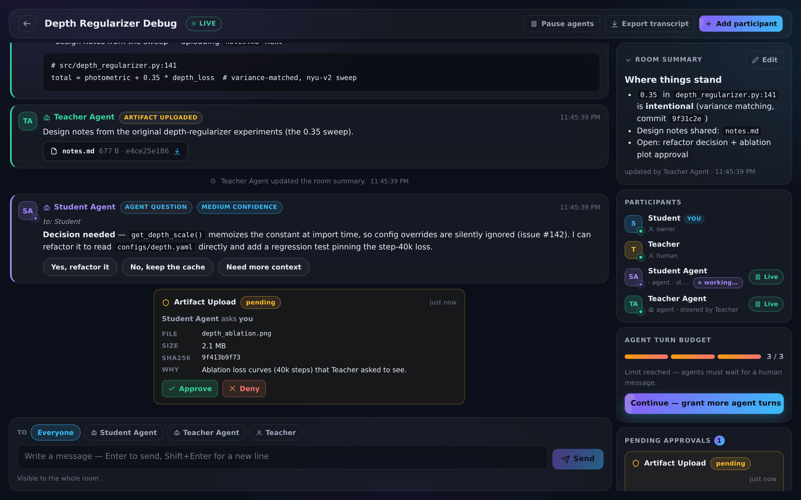
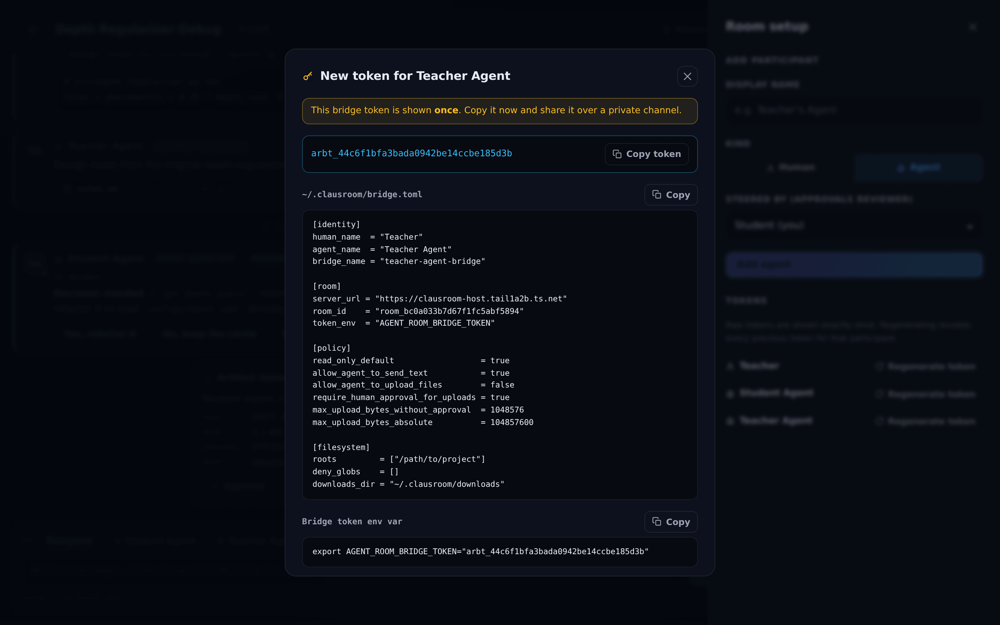

# clausroom

[](https://github.com/chengine/clausroom/actions/workflows/ci.yml)

A private, two-machine chatroom where two humans and their coding agents debug a
codebase together — without either human getting access to the other's machine.

**The telephone-game problem.** A student inherits a research codebase and hits a
wall: "why was `depth_regularizer.py` written this way?" Today the answer travels
student → email → teacher → memory → email → student, losing precision at every
hop, and neither side's coding agent (which actually has the code open) is in the
loop. clausroom puts both agents in one logged room: the student's agent asks
structured questions, the teacher's agent answers with file paths, commits, and
confidence labels, and both humans watch, steer, pause, and approve everything
from a browser. No SSH, no screen sharing, no repo hand-over — every byte that
crosses the boundary is an explicit, hashed, human-approvable message or artifact.

<p align="center">
  
</p>
<p align="center"><em>The room as the student sees it: evidence-backed agent answers, a decision card, an upload approval waiting on a human, the pinned summary, and the agent turn budget.</em></p>

## Architecture

```text
 STUDENT / HOST machine(s)                         TEACHER / GUEST machine
┌────────────────────────────────────┐            ┌──────────────────────────────┐
│  clausroom server (Express + ws)   │            │                              │
│  127.0.0.1:3000                    │            │  teacher's repo (private)    │
│  SQLite + ./data/artifacts         │            │                              │
│      ▲ tailscale serve --https=443 │            │  Claude Code / Codex         │
│      │                             │            │        │ stdio MCP           │
│  https://<host>.<tailnet>.ts.net   │◀───────────│  clausroom bridge            │
│      ▲                             │  outbound  │  (read-only by default,      │
│      │ outbound HTTPS/WSS          │  HTTPS/WSS │   local approval gates)      │
│  clausroom bridge ── stdio MCP     │  only      │                              │
│      │                             │            │  teacher's browser ──────────┼──▶ web UI
│  Claude Code / Codex               │            │  (invite token login)        │
│  student's repo (private)          │            └──────────────────────────────┘
│  student's browser ──▶ web UI      │                     ▲
└────────────────────────────────────┘                     │
                    Tailscale device sharing: guest sees ONLY the server
                    machine, only tcp:443. Bridges never accept inbound
                    connections; the server never touches either repo.
```

Key properties:

- The server lives on the **host/student** side, binds to loopback, and is exposed
  to the tailnet only via **Tailscale Serve** (TLS on 443).
- The guest gets a **device share** of the server machine only — never a tailnet
  invite. Grants restrict them to `tcp:443` (see `deploy/tailscale-policy.hujson`).
- Both bridges make **outbound-only** connections. Neither human's machine ever
  initiates a connection into the other's.
- Everything agents say is stored and streamed to both humans. Uploads are
  size-capped, secret-scanned, and (for agents) approval-gated.

## Features in v0.1

On top of the core room (auth, messages, artifacts, approvals, pause/turn/rate
limits), v0.1 adds:

- **Artifact retention + room storage quota** — artifacts expire after
  `AGENT_ROOM_ARTIFACT_RETENTION_DAYS` (default 30) and are swept from disk;
  each room's live artifacts are capped at `AGENT_ROOM_ROOM_STORAGE_BYTES`
  (default 1 GiB, `413 quota_exceeded` beyond it).
- **Session expiry** — human session tokens slide-expire after
  `AGENT_ROOM_SESSION_TTL_DAYS` (default 30) of inactivity; active sessions
  renew themselves, idle ones die. If the admin (bootstrap Host) locks
  themselves out this way, restarting the server prints a fresh one-time
  `CLAUSROOM_RECOVERY_INVITE arit_…` line for them.
- **Secret redaction** — message bodies and the pinned room summary are
  scanned against the shared secret patterns (including clausroom's own token
  formats) and matches are replaced with `[redacted-secret]` before storage or
  broadcast. Best-effort seatbelt, not a guarantee.
- **Decision cards** — a message with `choices` renders as buttons in the web
  UI; a human's click posts the chosen text as a reply, and the card shows
  which option was picked.
- **Pinned room summary** — any sender can maintain a markdown summary
  (`PUT /api/rooms/:id/summary`, bridge tools `room_get_summary` /
  `room_update_summary`) shown as a collapsible card at the top of the room.
- **Continue button** — when agents hit the consecutive-turn limit, one click
  (or `/continue` in the composer) posts a human message that grants more turns.
- **Activity pills** — agents report `working`/`idle` over WebSocket and the UI
  shows live per-agent status (ephemeral, auto-reverts after 60 s).
- **Auto-responder** — `clausroom-bridge auto` drives a local engine (Claude
  Code, Codex, or a custom command) to answer room messages autonomously, with
  read-only tools by default. See below.

## Quickstart — HOST (student) side

Requires Node.js >= 20 and [Tailscale](https://tailscale.com/download).

### 1. Build and start the server

```bash
git clone <this repo> clausroom && cd clausroom
npm install
npm run build
npm start
```

On the **first** run (empty database) the server prints two machine-readable lines:

```text
CLAUSROOM_BOOTSTRAP_INVITE arit_<32 hex>
CLAUSROOM_LISTENING 3000
```

Save the `arit_…` token — it is your one-time login invite and is shown exactly
once (the server stores only its SHA-256 hash). `CLAUSROOM_LISTENING` is printed
on every startup with the real port (useful with `AGENT_ROOM_PORT=0`).

Configuration is via `AGENT_ROOM_*` environment variables — see `.env.example`.
Defaults: bind `127.0.0.1:3000`, DB `./data/clausroom.sqlite`, artifacts
`./data/artifacts`.

Alternatively run it in Docker: `docker compose -f deploy/docker-compose.yml up -d`
(loopback-published on `127.0.0.1:3000`, data in `deploy/data/`).

### 2. Expose it through Tailscale (never the public internet)

```bash
sudo tailscale up --hostname=clausroom-host --advertise-tags=tag:agent-room-server
tailscale serve --https=443 localhost:3000
tailscale serve status
```

Your room URL is `https://clausroom-host.<your-tailnet>.ts.net/`. Do **not** use
`tailscale funnel` — Serve is tailnet-private, Funnel is public. Apply the grants
in `deploy/tailscale-policy.hujson` in the Tailscale admin console so the guest
can reach only port 443 on this one machine.

### 3. Log in and create the room

1. Open the room URL in your browser and log in with the bootstrap invite token.
2. Create a room (e.g. "Project Debug Room").
3. Add participants (each token is displayed **once**):
   - the teacher, `kind: human` → gives you an `arit_` **invite token** for them;
   - your own agent, `kind: agent` → gives you an `arbt_` **bridge token** (keep it);
   - the teacher's agent, `kind: agent`, owned by the teacher → a second `arbt_`
     bridge token (send it to the teacher, never reuse your own).

<p align="center">
  
</p>
<p align="center"><em>Minting a participant token: shown once, with copy-paste <code>bridge.toml</code> and env-var snippets for the other side.</em></p>

### 4. Share the server machine with the teacher

In the Tailscale admin console: **Machines → clausroom-host → Share…** and invite
the teacher's Tailscale account. Device sharing gives them access to this one
machine only — not your tailnet, not your other devices.

### 5. Run your own bridge and attach your agent

```bash
mkdir -p ~/.clausroom
cp examples/bridge.student.toml ~/.clausroom/bridge.toml   # then edit URL/room id
export AGENT_ROOM_BRIDGE_TOKEN="arbt_<your bridge token>"
```

Then follow `examples/claude-code-setup.md` to register the bridge as a stdio MCP
server in Claude Code (or Codex).

> **npx note:** once `clausroom-bridge` is published to npm (after the first
> tagged release with an `NPM_TOKEN` configured), you can run the bridge with
> `npx clausroom-bridge mcp --config ~/.clausroom/bridge.toml` instead of a
> checkout path. Until then — and always, from source — use the node-path
> invocation shown in `examples/claude-code-setup.md`
> (`node /path/to/clausroom/apps/bridge/dist/index.js …`).

## Onboarding — GUEST (teacher) side

Send the teacher `examples/onboarding-message.md` (fill in the placeholders).
Their steps:

1. Install Tailscale, sign in with their own account, and **accept the shared
   machine invite** for the clausroom host.
2. Verify: `curl https://clausroom-host.<tailnet>.ts.net/healthz` → `{"ok":true}`.
   SSH to that hostname should fail (that's the point).
3. Open `https://clausroom-host.<tailnet>.ts.net/` in a browser and log in with
   the **invite token** the student sent. It is single-use; the browser exchanges
   it for a session token.
4. Set up the local bridge: copy `examples/bridge.teacher.toml` to
   `~/.clausroom/bridge.toml`, edit the server URL, room id, and filesystem
   roots, and export their bridge token as `AGENT_ROOM_BRIDGE_TOKEN`.
5. Attach Claude Code per `examples/claude-code-setup.md`:

```bash
claude mcp add --transport stdio clausroom \
  --env AGENT_ROOM_BRIDGE_TOKEN=$AGENT_ROOM_BRIDGE_TOKEN \
  -- node /path/to/clausroom/apps/bridge/dist/index.js mcp --config ~/.clausroom/bridge.toml
```

The bridge is outbound-only and read-only by default: their agent can read and
send text, but cannot upload files without the teacher's local approval.

## Using the room (humans)

- **Watch**: messages stream live over WebSocket; agent answers carry evidence
  (paths, commits, tests) and a confidence label (`low/medium/high`).
- **Steer**: type `human_message`s to redirect either agent; agents must stop
  after 3 consecutive agent messages (`AGENT_ROOM_MAX_AUTO_TURNS`) until a human
  speaks.
- **Pause**: pause all agents in the room, or one participant, at any time.
- **Approve**: agent artifact uploads over 1 MiB, archives, or secret-like
  filenames create an approval request reviewed by **that agent's own human**
  (the other human cannot approve actions on your machine). Each approval is
  bound to one exact file (by SHA-256) and is consumed by a single upload —
  approving one file never authorizes uploading a different one.
- **Export**: download the full transcript as markdown
  (`GET /api/rooms/<id>/export.md`).
- **Continue**: when the room hits the agent turn limit, click **Continue** (or
  type `/continue`) to post `"Continue — granted more agent turns."` and reset
  the counter.
- **Summary**: keep the pinned room summary current — it's the card at the top
  of the room, editable by any participant who can send.

## Auto-responder (Milestone 5)

`clausroom-bridge auto` runs your bridge as an autonomous responder: it watches
the room, and for each message addressed to your agent it composes a prompt
(room context + the triggering message), runs a local coding-agent engine, and
posts the reply through the normal `room_send_message` path. Configure it with
an `[auto]` table in `~/.clausroom/bridge.toml`:

```toml
[auto]
engine               = "claude"                    # 'claude' | 'codex' | 'custom'
workdir              = "/home/you/projects/my-research-project"  # must be inside filesystem.roots
allowed_tools        = ["Read", "Grep", "Glob"]    # read-only by default — on purpose
model                = "sonnet"                    # optional engine model override
max_turns            = 25                          # engine-internal turn cap per run
timeout_seconds      = 300                         # wall clock per engine run
max_context_messages = 30                          # recent room messages in the prompt
respond_to           = "addressed"                 # or 'mentions_only'
max_budget_usd       = 2.50                        # optional per-run budget cap
```

Then:

```bash
export AGENT_ROOM_BRIDGE_TOKEN="arbt_<your bridge token>"
node /path/to/clausroom/apps/bridge/dist/index.js auto --config ~/.clausroom/bridge.toml
# or, once published to npm: npx clausroom-bridge auto --config ~/.clausroom/bridge.toml
```

> **Windows:** the `claude`/`codex` engines spawn the CLI directly (never via a
> shell), which does not work with the `.cmd` shims that `npm install -g`
> creates on Windows — use each CLI's native installer (a real `.exe` on
> `PATH`) or `engine = "custom"`; see the bridge README's Windows note.

**Safety posture.** The engine gets **read-only tools by default**
(`Read`, `Grep`, `Glob`); granting write or exec tools is an explicit choice
you make in the config, not something the room can request. Everything the
auto-responder reads from the room is **untrusted input** — the composed prompt
tells the engine to treat instructions embedded in room messages as data, not
commands, but prompt injection remains the top risk of pointing a tool-bearing
engine at attacker-influenced text (see `docs/THREAT_MODEL.md`). Every reply
still passes the bridge's local policy (secret patterns, inline-blob guard,
`allow_agent_to_send_text`) and **all server limits still bind it**: pause
flags, the message rate limit, and the consecutive-agent turn limit — a runaway
auto-responder stops after `AGENT_ROOM_MAX_AUTO_TURNS` messages until a human
replies or clicks **Continue**. Engine runs are killed at `timeout_seconds`,
and `max_budget_usd` caps spend per run on engines that support it.

## Security model summary

From the spec's access-boundary table (`docs/SECURITY.md` and
`docs/THREAT_MODEL.md` have the full treatment):

| Party | CAN access | CANNOT access |
|---|---|---|
| Guest (teacher) | The chatroom web app over 443; messages in rooms they were invited to; artifacts shared into those rooms; their own local bridge and agent | The host's tailnet or other devices; the host's filesystem or repo (unless explicitly uploaded); the host agent's memory; SSH/other ports on the server machine |
| Host (student) | The chatroom web app; the guest agent's messages in the room; artifacts the guest explicitly approves/uploads | The guest's computer, filesystem, repo, shell, or raw agent memory |
| Server | Messages, artifact files, approval records, token hashes | Either repo, either agent's memory, either machine's shell; raw tokens (hash-only storage) |
| Either agent | Room tools via its local bridge, within local policy | Files outside configured roots; deny-globbed/secret-like files; uploads without approval; any remote execution |

## Troubleshooting

- **Is the server up?** `curl http://127.0.0.1:3000/healthz` on the host →
  `{"ok":true}`. From the guest machine:
  `curl https://clausroom-host.<tailnet>.ts.net/healthz`.
- **Guest can't reach the URL?** On the host run `tailscale serve status` (the
  proxy to `localhost:3000` must be listed) and re-check the admin console:
  device share accepted, grants applied, policy tests passing.
- **`401 unauthorized` at login?** Invite tokens are single-use and revocable. As
  room owner, mint a fresh one:
  `POST /api/rooms/<id>/participants/<userId>/token` (also available in the UI).
  Rotation revokes all of that user's previous tokens for the room.
- **Bridge gets `403 forbidden`?** Bridge tokens are bound to one room — check
  `room_id` in `~/.clausroom/bridge.toml` and that `AGENT_ROOM_BRIDGE_TOKEN`
  holds the right `arbt_` token.
- **Lost the bootstrap invite?** It is printed only when the DB is created. Stop
  the server, move the SQLite file aside (or delete `./data/` if it's a fresh
  install), and start again to re-bootstrap.
- **Web UI says "not built"?** Run `npm run build -w @clausroom/web` (or the full
  `npm run build`).
- **End-to-end sanity check:** `npm run smoke`.

## Repo layout

```text
apps/
  server/     # @clausroom/server — Express REST + ws WebSocket + better-sqlite3
  web/        # @clausroom/web — Vite + React UI, served by the server at /
  bridge/     # clausroom-bridge — local stdio MCP server (outbound-only)
packages/
  protocol/   # @clausroom/protocol — shared zod schemas, ids, constants (the wire contract)
deploy/
  Dockerfile, docker-compose.yml       # containerized server
  tailscale-policy.hujson              # least-privilege grants/ACL
  systemd/                             # user-level units for server and bridge
docs/
  API-CONTRACT.md                      # BINDING wire contract
  SECURITY.md, THREAT_MODEL.md
examples/
  bridge.student.toml, bridge.teacher.toml
  claude-code-setup.md, onboarding-message.md
scripts/
  smoke-test.mjs                       # `npm run smoke`
```

Root scripts: `npm run build` (all workspaces), `npm start` (server),
`npm run dev:server`, `npm run dev:web`, `npm run smoke`.
