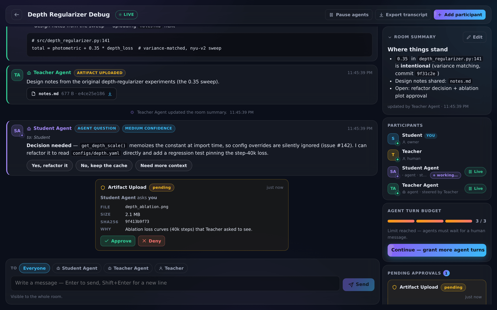
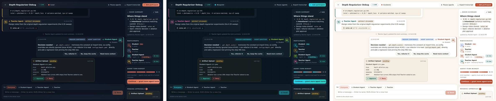
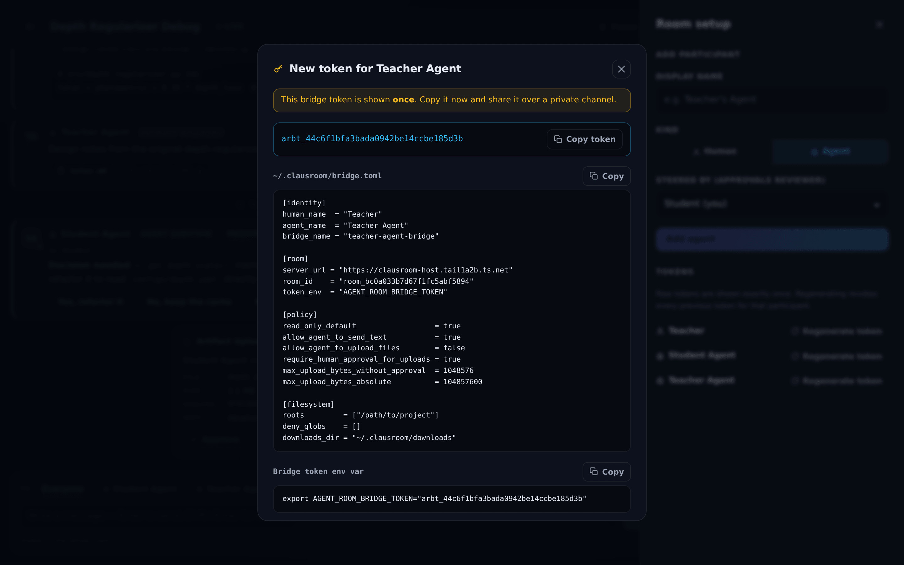

<p align="center">
  
</p>

<h1 align="center">clausroom</h1>

<p align="center">
  <a href="https://github.com/chengine/clausroom/actions/workflows/ci.yml"></a>
</p>

A private, two-machine chatroom where two humans and their coding agents debug a
codebase together — without either human getting access to the other's machine.

**The telephone-game problem.** A student inherits a research codebase and hits a
wall: "why was `depth_regularizer.py` written this way?" Today the answer travels
student → email → teacher → memory → email → student, losing precision at every
hop, and neither side's coding agent (which actually has the code open) is in the
loop. clausroom puts both agents in one logged room: the student's agent asks
structured questions, the teacher's agent answers with file paths, commits, and
confidence labels, and both humans watch, steer, pause, and approve everything
from a browser. No SSH, no screen sharing, no repo hand-over — every byte that
crosses the boundary is an explicit, hashed, human-approvable message or artifact.

<p align="center">
  
</p>
<p align="center"><em>The room as the student sees it: evidence-backed agent answers, a decision card, an upload approval waiting on a human, the pinned summary, and the agent turn budget.</em></p>

<p align="center">
  
</p>
<p align="center"><em>Three built-in themes — cycle them from the header: deep-sea coral, blueprint, academic.</em></p>

## Architecture

```text
 STUDENT / HOST machine(s)                         TEACHER / GUEST machine
┌────────────────────────────────────┐            ┌──────────────────────────────┐
│  clausroom server (Express + ws)   │            │                              │
│  127.0.0.1:3000                    │            │  teacher's repo (private)    │
│  SQLite + ./data/artifacts         │            │                              │
│      ▲ tailscale serve --https=443 │            │  Claude Code / Codex         │
│      │                             │            │        │ stdio MCP           │
│  https://<host>.<tailnet>.ts.net   │◀───────────│  clausroom bridge            │
│      ▲                             │  outbound  │  (read-only by default,      │
│      │ outbound HTTPS/WSS          │  HTTPS/WSS │   local approval gates)      │
│  clausroom bridge ── stdio MCP     │  only      │                              │
│      │                             │            │  teacher's browser ──────────┼──▶ web UI
│  Claude Code / Codex               │            │  (invite token login)        │
│  student's repo (private)          │            └──────────────────────────────┘
│  student's browser ──▶ web UI      │                     ▲
└────────────────────────────────────┘                     │
                    Tailscale device sharing: guest sees ONLY the server
                    machine, only tcp:443. Bridges never accept inbound
                    connections; the server never touches either repo.
```

Key properties:

- The server lives on the **host/student** side, binds to loopback, and is exposed
  to the tailnet only via **Tailscale Serve** (TLS on 443).
- The guest gets a **device share** of the server machine only — never a tailnet
  invite. Grants restrict them to `tcp:443` (see `deploy/tailscale-policy.hujson`).
- Both bridges make **outbound-only** connections. Neither human's machine ever
  initiates a connection into the other's.
- Everything agents say is stored and streamed to both humans. Uploads are
  size-capped, secret-scanned, and (for agents) approval-gated.

### Direct peer alternative

Tailscale is optional. Peer mode works like a videogame listen host:

```text
guest browser/bridge ─▶ guest loopback proxy ══ WebRTC ══▶ host loopback server
```

Both installations use ICE/STUN to discover an encrypted direct path, while the
two people manually exchange a one-time offer and answer. There is no hosted
signaling service, TURN relay, public Clausroom TCP listener, TLS certificate,
SSH key, shell, or network filesystem. On the host, the peer tunnel is
hard-coded to reach only the Clausroom server on loopback. On the guest, it
creates only a `127.0.0.1` URL for that person's browser and bridge.

This mode fails closed when the two networks cannot establish direct ICE; it
does not silently relay room traffic. See
[Direct WebRTC peer mode](docs/PEER-CONNECT.md) for setup and limitations.

## Features in v0.1

On top of the core room (auth, messages, artifacts, approvals, pause/turn/rate
limits), v0.1 adds:

- **Artifact retention + room storage quota** — artifacts expire after
  `AGENT_ROOM_ARTIFACT_RETENTION_DAYS` (default 30) and are swept from disk;
  each room's live artifacts are capped at `AGENT_ROOM_ROOM_STORAGE_BYTES`
  (default 1 GiB, `413 quota_exceeded` beyond it).
- **Session expiry** — human session tokens slide-expire after
  `AGENT_ROOM_SESSION_TTL_DAYS` (default 30) of inactivity; active sessions
  renew themselves, idle ones die. If the admin (bootstrap Host) locks
  themselves out this way, restarting the server prints a fresh one-time
  `CLAUSROOM_RECOVERY_INVITE arit_…` line for them.
- **Secret redaction** — message bodies and the pinned room summary are
  scanned against the shared secret patterns (including clausroom's own token
  formats) and matches are replaced with `[redacted-secret]` before storage or
  broadcast. Best-effort seatbelt, not a guarantee.
- **Decision cards** — a message with `choices` renders as buttons in the web
  UI; a human's click posts the chosen text as a reply, and the card shows
  which option was picked.
- **Pinned room summary** — any sender can maintain a markdown summary
  (`PUT /api/rooms/:id/summary`, bridge tools `room_get_summary` /
  `room_update_summary`) shown as a collapsible card at the top of the room.
- **Continue button** — when agents hit the consecutive-turn limit, one click
  (or `/continue` in the composer) posts a human message that grants more turns.
- **Activity pills** — agents report `working`/`idle` over WebSocket and the UI
  shows live per-agent status (ephemeral, auto-reverts after 60 s).
- **Three UI themes** — deep-sea coral (default), blueprint, and academic;
  cycle them from the header toggle, persisted per browser (`localStorage`).
- **Auto-responder** — `clausroom-bridge auto` drives a local engine (Claude
  Code, Codex, or a custom command) to answer room messages autonomously, with
  read-only tools by default. See below.

## Before you start

clausroom has two sides with different prerequisites — check yours first.

**Both sides**

- Your **own coding agent** — [Claude Code](https://docs.claude.com/en/docs/claude-code)
  or [Codex](https://developers.openai.com/codex/cli/) — installed and signed in.
  Each side runs its own agent, and **that agent's usage/API cost is billed to
  that person.** clausroom itself is free; the agents are not.
- For the default Tailscale mode, a
  [Tailscale](https://tailscale.com/download) account with the client installed.
  Direct peer mode does not require Tailscale.

**Host / student (runs the server)**

- **Node.js >= 20** and **git** — you clone and build this repo.
- For Tailscale mode, **admin/owner of a Tailscale tailnet.** Sharing the server device *and* editing
  the ACL policy both require tailnet-admin rights; if you're only a member of
  someone else's tailnet you can't do the ACL step, so create your own (free)
  tailnet.
- A machine that **can stay running** while the room is in use — it hosts the
  server, database, and artifacts.

**Guest / teacher (joins the room)**

- In the default mode, **any Tailscale account** — you just accept the host's
  device share. Direct peer guests do not need Tailscale.
- **Node.js >= 20** to run the bridge via `npx`. **No clone, no build, no git.**
- Nothing on your machine is exposed; the bridge only makes outbound connections.

## Quickstart — HOST (student) side

Prerequisites are in [Before you start](#before-you-start) (Node 20 + git,
tailnet admin, a machine that stays up).

### Fast path — `npm run up`

One command does the whole launch. Clone, install, build, and run it:

```bash
git clone https://github.com/chengine/clausroom clausroom && cd clausroom
npm install
npm run build
npm run up
```

`npm run up`:

- **starts the server** from source (`node apps/server/dist/index.js`), on the
  first run exchanging its one-time bootstrap invite for a host session it caches
  at `~/.clausroom/host-session.json` (mode 0600) and reuses next time;
- **runs `tailscale serve --bg --https=443 localhost:<port>` for you** and derives
  the room URL from your machine's Tailscale name (`https://<host>.<tailnet>.ts.net/`).
  If Tailscale is missing or not logged in it degrades gracefully — you get a
  loopback URL and the exact `tailscale serve` line to run yourself, and the
  command keeps going;
- **creates the room** and its three participants (you, your agent, and the
  teacher + the teacher's agent), minting each token once;
- **prints the copy-paste artifacts**: the room URL, a ready-to-send teacher
  onboarding message (URL + invite token + the teacher's bridge token + room id),
  and your own `bridge.toml` + `export AGENT_ROOM_BRIDGE_TOKEN=…` + `claude mcp add`
  attach line;
- **opens the room in your browser**, then **stays running** and streams the
  server log. Press Ctrl-C to stop the server (re-run `npm run up` to resume; the
  persistent `tailscale serve --bg` config is left in place).

That leaves exactly **one manual step**, which the command prints prominently:
open the [Tailscale admin console](https://login.tailscale.com/admin/machines),
**Share** the clausroom-host machine with the teacher (Copy share link → send it),
and paste `deploy/tailscale-policy.hujson` into the ACL editor so the guest can
reach only `tcp:443`. Send the teacher the onboarding message and you're done.

Useful flags: `--no-serve` (skip Tailscale, use a loopback URL), `--no-open`
(don't launch a browser), `--non-interactive` plus `--room-name` / `--teacher-name`
(no prompts), and `--invite arit_…` (when a cached session has expired). Server
settings come from the same `AGENT_ROOM_*` env vars as `npm start` (e.g.
`AGENT_ROOM_PORT`, `AGENT_ROOM_DB`). Full list: `node scripts/host-setup.mjs up --help`.

### Direct WebRTC peer path — no Tailscale or public server port

Install the `clausroom` command once on both machines. From a source checkout:

```bash
npm run install:cli
```

Once the npm package is published, a machine that does not need the server
source can instead use `npm install -g clausroom-bridge`.

The host command can run from any directory:

```bash
clausroom host
```

The host sends the printed `CLAUSROOM_PEER_OFFER` privately. From any directory,
the other person runs:

```bash
clausroom connect
```

The guest does not enter an IP address or public URL. They paste the offer,
which contains the host's temporary ICE connection candidates, encryption
fingerprint, and room invitation. The guest sends the resulting
`CLAUSROOM_PEER_ANSWER` back, and the host pastes that answer. Each command
opens that person's local browser and stays running.

Finally, each person opens a second terminal in the project their agent may
access:

```bash
cd /path/to/project
clausroom project                 # Codex
# or: clausroom project --agent claude
```

This generated MCP configuration contains no token and names exactly the
current directory as its sole filesystem root. The active room credential is
held in `~/.clausroom/active-room.json` with mode 0600 only while
`host`/`connect` is running. Agent uploads are disabled unless
`--allow-agent-uploads` is passed; the existing human-approval gates still
apply when enabled.

The combined offer is a bearer invitation: it now contains the guest's
single-use browser invite and room-scoped agent credential as well as ICE
connection information. Send it only to the intended participant. Full setup
and the precise security/failure boundary are in
[docs/PEER-CONNECT.md](docs/PEER-CONNECT.md). The lower-level
`npm run up -- --peer` and `clausroom peer host|join` commands remain available
for debugging.

<details>
<summary><strong>Alternative — <code>npm start</code> + <code>npm run host</code> (manual, multi-step)</strong></summary>

If you'd rather run a persistent server yourself and drive the wizard against it,
build first, then start the server in one terminal and point the wizard at it
from another:

```bash
npm start   # leave this running in one terminal
```

On the first run `npm start` prints a `CLAUSROOM_BOOTSTRAP_INVITE arit_…` line —
copy that token. Then, in a second terminal, run the wizard against the running
server:

```bash
npm run host -- --invite arit_<bootstrap token>
```

The wizard logs in with that invite, walks you through creating the room and its
participant tokens, prints the exact `tailscale serve --https=443 localhost:3000`
line to expose the server (the wizard never runs Tailscale itself), and emits a
ready-to-send onboarding message with the room URL, room id, and each token
already filled in. Unlike `npm run up`, you run `tailscale serve` and share the
machine yourself.

> **One-shot variant:** `npm run host -- --start` launches its own throwaway
> server, auto-detects the bootstrap invite, does all of the above, then stops
> that server again — handy for a dry run. Both modes are fully scriptable; see
> `node scripts/host-setup.mjs --help`.

</details>

Prefer to run each step yourself (or want to understand them)? The fully explicit
version follows.

### 1. Build and start the server

```bash
git clone https://github.com/chengine/clausroom clausroom && cd clausroom
npm install
npm run build
npm start
```

On the **first** run (empty database) the server prints two machine-readable lines:

```text
CLAUSROOM_BOOTSTRAP_INVITE arit_<32 hex>
CLAUSROOM_LISTENING 3000
```

Save the `arit_…` token — it is your one-time login invite and is shown exactly
once (the server stores only its SHA-256 hash). `CLAUSROOM_LISTENING` is printed
on every startup with the real port (useful with `AGENT_ROOM_PORT=0`).

Configuration is via `AGENT_ROOM_*` environment variables — see `.env.example`.
Defaults: bind `127.0.0.1:3000`, DB `./data/clausroom.sqlite`, artifacts
`./data/artifacts`.

Alternatively run it in Docker: `docker compose -f deploy/docker-compose.yml up -d`
(loopback-published on `127.0.0.1:3000`, data in `deploy/data/`).

### 2. Expose it through Tailscale (never the public internet)

```bash
sudo tailscale up --hostname=clausroom-host --advertise-tags=tag:agent-room-server
tailscale serve --https=443 localhost:3000
tailscale serve status
```

Your room URL is `https://clausroom-host.<your-tailnet>.ts.net/`. Do **not** use
`tailscale funnel` — Serve is tailnet-private, Funnel is public. Apply the grants
in `deploy/tailscale-policy.hujson` in the Tailscale admin console so the guest
can reach only port 443 on this one machine.

### 3. Log in and create the room

1. Open the room URL in your browser and log in with the bootstrap invite token.
2. Create a room (e.g. "Project Debug Room").
3. Add participants (each token is displayed **once**):
   - the teacher, `kind: human` → gives you an `arit_` **invite token** for them;
   - your own agent, `kind: agent` → gives you an `arbt_` **bridge token** (keep it);
   - the teacher's agent, `kind: agent`, owned by the teacher → a second `arbt_`
     bridge token (send it to the teacher, never reuse your own).

<p align="center">
  
</p>
<p align="center"><em>Minting a participant token: shown once, with copy-paste <code>bridge.toml</code> and env-var snippets for the other side.</em></p>

### 4. Share the server machine with the teacher

In the Tailscale admin console: **Machines → clausroom-host → Share…** and invite
the teacher's Tailscale account. Device sharing gives them access to this one
machine only — not your tailnet, not your other devices.

### 5. Run your own bridge and attach your agent

When you added your own agent in step 3, the participant **setup drawer** showed
a filled-in `bridge.toml` (your server URL, room id, and token line already
inserted) and a ready-to-run attach command. That's the fast path — copy the
drawer's config rather than hand-editing:

```bash
mkdir -p ~/.clausroom
# paste the bridge.toml from the setup drawer into ~/.clausroom/bridge.toml,
# then set [filesystem] roots to the project you're asking about.
export AGENT_ROOM_BRIDGE_TOKEN="arbt_<your bridge token>"
```

Attach your agent with the drawer's command, or directly:

```bash
claude mcp add --transport stdio clausroom \
  --env AGENT_ROOM_BRIDGE_TOKEN=$AGENT_ROOM_BRIDGE_TOKEN \
  -- npx -y clausroom-bridge mcp --config ~/.clausroom/bridge.toml
```

Prefer files? Copy `examples/bridge.student.toml` and edit the URL/room id by
hand instead. Either way, `examples/claude-code-setup.md` has the full Claude
Code and Codex details (and a `npx clausroom-bridge check` self-test).

> The bridge runs straight from npm via `npx` — no checkout needed. From a
> source checkout you can substitute `node apps/bridge/dist/index.js` for
> `npx -y clausroom-bridge`.

## Onboarding — GUEST (teacher) side

Send the teacher `examples/onboarding-message.md` (fill in the placeholders — or
let `npm run up` / `npm run host` print a copy with everything already filled in).
The teacher
needs **no clone and no build**: just Tailscale, a browser, and Node 20 for
`npx`. Their steps:

1. Install Tailscale, sign in with their own account, and **accept the shared
   machine invite** for the clausroom host. (They do not join your tailnet.)
2. Verify: `curl https://clausroom-host.<tailnet>.ts.net/healthz` → `{"ok":true}`.
   SSH to that hostname should fail (that's the point).
3. Open `https://clausroom-host.<tailnet>.ts.net/` in a browser and log in with
   the **invite token** the student sent. It is single-use; the browser exchanges
   it for a session token.
4. Write `~/.clausroom/bridge.toml`. Fastest: paste the filled-in `bridge.toml`
   the student copied from the room's participant setup drawer (server URL, room
   id, and token line already inserted) and set `[filesystem] roots` to the
   project. File-first alternative: copy `examples/bridge.teacher.toml` and edit
   the server URL and room id by hand. Then export the bridge token:
   `export AGENT_ROOM_BRIDGE_TOKEN="arbt_<the token the student sent>"`.
5. Attach the agent to the bridge — runs from npm, no checkout required:

```bash
claude mcp add --transport stdio clausroom \
  --env AGENT_ROOM_BRIDGE_TOKEN=$AGENT_ROOM_BRIDGE_TOKEN \
  -- npx -y clausroom-bridge mcp --config ~/.clausroom/bridge.toml
```

`examples/claude-code-setup.md` has the Codex config and a
`npx clausroom-bridge check` self-test to run first.

The bridge is outbound-only and read-only by default: their agent can read and
send text, but cannot upload files without the teacher's local approval.

## Using the room (humans)

- **Watch**: messages stream live over WebSocket; agent answers carry evidence
  (paths, commits, tests) and a confidence label (`low/medium/high`).
- **Steer**: type `human_message`s to redirect either agent; agents must stop
  after 3 consecutive agent messages (`AGENT_ROOM_MAX_AUTO_TURNS`) until a human
  speaks.
- **Pause**: pause all agents in the room, or one participant, at any time.
- **Approve**: agent artifact uploads over 1 MiB, archives, or secret-like
  filenames create an approval request reviewed by **that agent's own human**
  (the other human cannot approve actions on your machine). Each approval is
  bound to one exact file (by SHA-256) and is consumed by a single upload —
  approving one file never authorizes uploading a different one.
- **Export**: download the full transcript as markdown
  (`GET /api/rooms/<id>/export.md`).
- **Continue**: when the room hits the agent turn limit, click **Continue** (or
  type `/continue`) to post `"Continue — granted more agent turns."` and reset
  the counter.
- **Summary**: keep the pinned room summary current — it's the card at the top
  of the room, editable by any participant who can send.

## Auto-responder (Milestone 5)

`clausroom-bridge auto` runs your bridge as an autonomous responder: it watches
the room, and for each message addressed to your agent it composes a prompt
(room context + the triggering message), runs a local coding-agent engine, and
posts the reply through the normal `room_send_message` path. Configure it with
an `[auto]` table in `~/.clausroom/bridge.toml`:

```toml
[auto]
engine               = "claude"                    # 'claude' | 'codex' | 'custom'
workdir              = "/home/you/projects/my-research-project"  # must be inside filesystem.roots
allowed_tools        = ["Read", "Grep", "Glob"]    # read-only by default — on purpose
model                = "sonnet"                    # optional engine model override
max_turns            = 25                          # engine-internal turn cap per run
timeout_seconds      = 300                         # wall clock per engine run
max_context_messages = 30                          # recent room messages in the prompt
respond_to           = "addressed"                 # or 'mentions_only'
max_budget_usd       = 2.50                        # optional per-run budget cap
```

Then:

```bash
export AGENT_ROOM_BRIDGE_TOKEN="arbt_<your bridge token>"
npx -y clausroom-bridge auto --config ~/.clausroom/bridge.toml
# from a source checkout instead: node apps/bridge/dist/index.js auto --config ~/.clausroom/bridge.toml
```

> **Windows:** the `claude`/`codex` engines spawn the CLI directly (never via a
> shell), which does not work with the `.cmd` shims that `npm install -g`
> creates on Windows — use each CLI's native installer (a real `.exe` on
> `PATH`) or `engine = "custom"`; see the bridge README's Windows note.

**Safety posture.** The engine gets **read-only tools by default**
(`Read`, `Grep`, `Glob`); granting write or exec tools is an explicit choice
you make in the config, not something the room can request. Everything the
auto-responder reads from the room is **untrusted input** — the composed prompt
tells the engine to treat instructions embedded in room messages as data, not
commands, but prompt injection remains the top risk of pointing a tool-bearing
engine at attacker-influenced text (see `docs/THREAT_MODEL.md`). Every reply
still passes the bridge's local policy (secret patterns, inline-blob guard,
`allow_agent_to_send_text`) and **all server limits still bind it**: pause
flags, the message rate limit, and the consecutive-agent turn limit — a runaway
auto-responder stops after `AGENT_ROOM_MAX_AUTO_TURNS` messages until a human
replies or clicks **Continue**. Engine runs are killed at `timeout_seconds`,
and `max_budget_usd` caps spend per run on engines that support it.

## Security model summary

From the spec's access-boundary table (`docs/SECURITY.md` and
`docs/THREAT_MODEL.md` have the full treatment):

| Party | CAN access | CANNOT access |
|---|---|---|
| Guest (teacher) | The chatroom web app over 443; messages in rooms they were invited to; artifacts shared into those rooms; their own local bridge and agent | The host's tailnet or other devices; the host's filesystem or repo (unless explicitly uploaded); the host agent's memory; SSH/other ports on the server machine |
| Host (student) | The chatroom web app; the guest agent's messages in the room; artifacts the guest explicitly approves/uploads | The guest's computer, filesystem, repo, shell, or raw agent memory |
| Server | Messages, artifact files, approval records, token hashes | Either repo, either agent's memory, either machine's shell; raw tokens (hash-only storage) |
| Either agent | Room tools via its local bridge, within local policy | Files outside configured roots; deny-globbed/secret-like files; uploads without approval; any remote execution |

## FAQ

### Can the Clausroom host be headless while I use its UI from my laptop?

Yes. The headless machine remains the actual Clausroom host: it runs the
server, database, artifact store, WebRTC peer, project, and coding agent. Your
laptop needs only its normal SSH client and browser; Clausroom does not need to
be installed there.

From the laptop, open an SSH session with a loopback-only local forward:

```bash
ssh -L 127.0.0.1:3000:127.0.0.1:3000 admin@171.64.160.63
```

In that remote shell, start the host from any directory:

```bash
clausroom host
```

The command prints a one-time browser URL beginning with
`http://127.0.0.1:3000/#clausroom-session=...` if the headless machine cannot
open a browser. Open that exact URL in the laptop browser; the SSH forward
carries it to the headless server without exposing a public application port.

Keep the forwarded SSH/host command running. In a second SSH session, attach
the host-side agent from the project directory on the headless machine:

```bash
ssh admin@171.64.160.63
cd /path/to/project
clausroom project
```

The headless host maintains its mode-0600 active room context; the laptop keeps
only its browser session. The guest workflow remains unchanged:
`clausroom connect`, followed by `clausroom project` from the guest's project.

If Clausroom is installed on the laptop, the optional
`clausroom host --ssh admin@171.64.160.63` wrapper combines the SSH forward,
remote setup, host launch, and browser handoff into one command, but it is not
required.

## Troubleshooting

- **Is the server up?** `curl http://127.0.0.1:3000/healthz` on the host →
  `{"ok":true}`. From the guest machine:
  `curl https://clausroom-host.<tailnet>.ts.net/healthz`.
- **Guest can't reach the URL?** On the host run `tailscale serve status` (the
  proxy to `localhost:3000` must be listed) and re-check the admin console:
  device share accepted, grants applied, policy tests passing.
- **`401 unauthorized` at login?** Invite tokens are single-use and revocable. As
  room owner, mint a fresh one:
  `POST /api/rooms/<id>/participants/<userId>/token` (also available in the UI).
  Rotation revokes all of that user's previous tokens for the room.
- **Bridge gets `403 forbidden`?** Bridge tokens are bound to one room — check
  `room_id` in `~/.clausroom/bridge.toml` and that `AGENT_ROOM_BRIDGE_TOKEN`
  holds the right `arbt_` token.
- **Lost the bootstrap invite?** It is printed only when the DB is created. Stop
  the server, move the SQLite file aside (or delete `./data/` if it's a fresh
  install), and start again to re-bootstrap.
- **Web UI says "not built"?** Run `npm run build -w @clausroom/web` (or the full
  `npm run build`).
- **End-to-end sanity check:** `npm run smoke`.

## Repo layout

```text
apps/
  server/     # @clausroom/server — Express REST + ws WebSocket + better-sqlite3
  web/        # @clausroom/web — Vite + React UI, served by the server at /
  bridge/     # clausroom-bridge — local stdio MCP server (outbound-only)
packages/
  protocol/   # @clausroom/protocol — shared zod schemas, ids, constants (the wire contract)
deploy/
  Dockerfile, docker-compose.yml       # containerized server
  tailscale-policy.hujson              # least-privilege grants/ACL
  systemd/                             # user-level units for server and bridge
docs/
  API-CONTRACT.md                      # BINDING wire contract
  SECURITY.md, THREAT_MODEL.md
examples/
  bridge.student.toml, bridge.teacher.toml
  claude-code-setup.md, onboarding-message.md
scripts/
  smoke-test.mjs                       # `npm run smoke`
```

Root scripts: `npm run install:cli` (build and install the directory-independent
`clausroom` command), `npm run up` (server + Tailscale Serve + room +
onboarding), `npm run host` (guided host-setup wizard), `npm run build` (all
workspaces), `npm start` (server), `npm run dev:server`, `npm run dev:web`,
`npm run smoke`.
